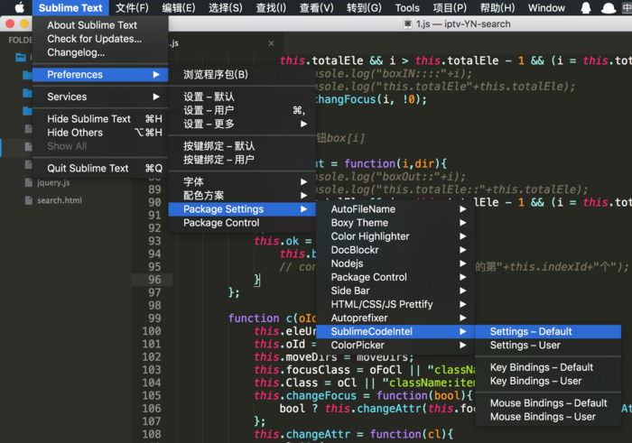
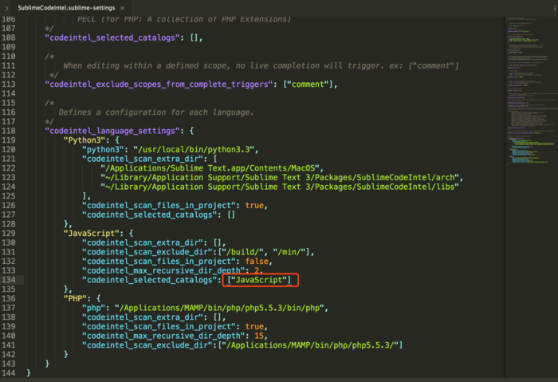

# Sublime Text3 插件安装说明

## 安装环境
	第一次安装插件时需要先配置sublime Text3 de 安装环境
	1.按Ctrl+`调出console
	2.将一下代码复制到sublime 下方的输入栏中：

		import urllib.request,os; pf = 'Package Control.sublime-package'; ipp = sublime.installed_packages_path(); urllib.request.install_opener( urllib.request.build_opener( urllib.request.ProxyHandler()) ); open(os.path.join(ipp, pf), 'wb').write(urllib.request.urlopen( 'http://sublime.wbond.net/' + pf.replace(' ','%20')).read())

	3. 重启Sublime Text 3。
	4. 如果在Perferences->package settings中看到package control这一项，则安装成功。

## 安装插件
	1.按下Ctrl+Shift+P调出命令面板。
	2.输入install 调出 Install Package 选项并回车，然后在列表中选中要安装的插件。

## JS常用插件包

插件包名称 :使用快捷键 , 功能说明 

1.ChineseLocalizations : 无        , 汉化包  
2.Emmet                : ?? , 一种快速编写html/css的方法  
3.BracketHighlighter   : 无 ，匹配大括号  
4.Autoprefixer         : 无 , 私有前缀补齐  
5.HTML-CSS-JS Prettify : ctrl+shift+h , 快速格式化html css js  
6.Colorpicker          : ctrl+shift+c , 使用一个取色器改变颜色  
7.SyncedSidebarBg      : 无 ，同步侧边栏底色为编辑窗口底色  
8.AutoFileName         : 无 ，文件路径补全，/即可看到文件名  
9.SideBarEnhancements  : 无 ，增强侧边栏 我也不知道有什么用  
10.SublimeCodeIntel    : 无 , JavaScript自动补全,需要将Preferences -> Package Setting -> SublimeCodeIntel -> Setting Default  中JavaScript类中的JQuery 替换为 JavaScript 如下图所示

